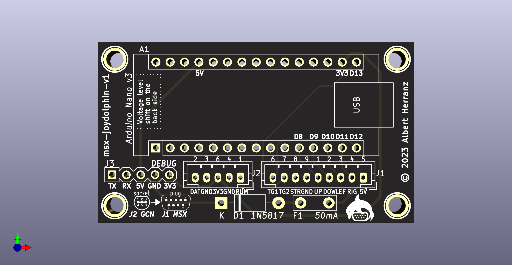
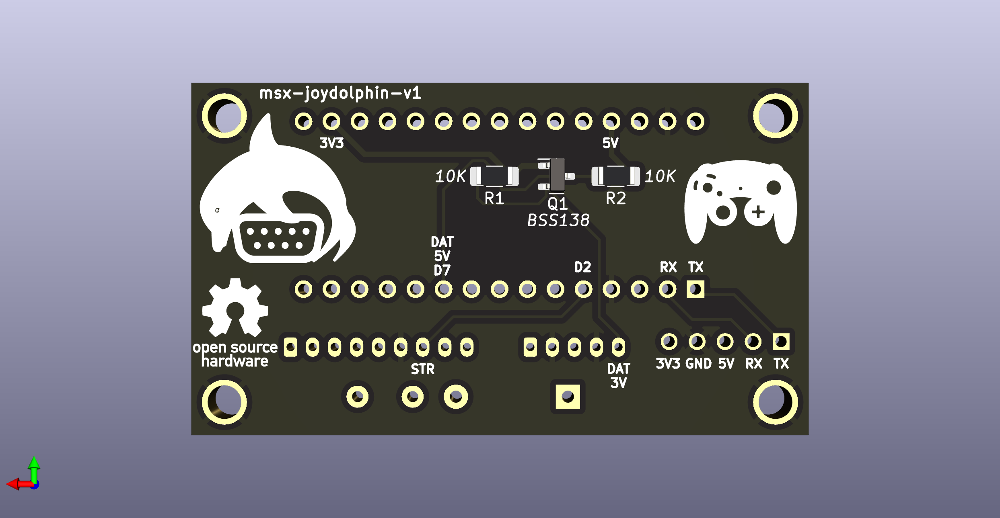
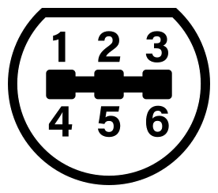
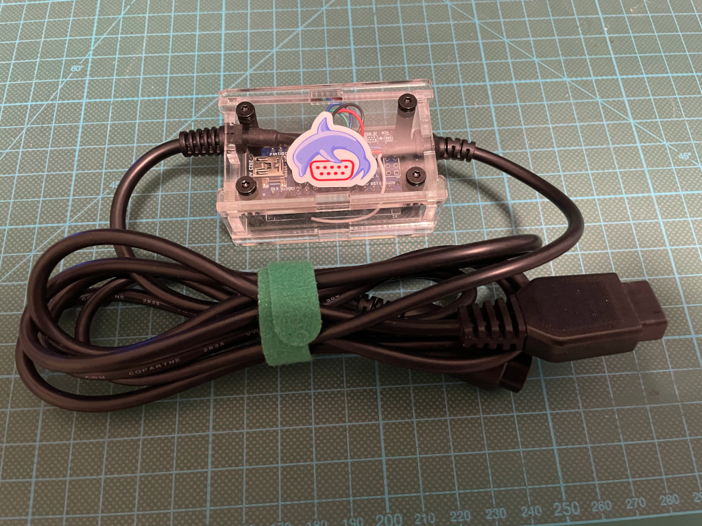
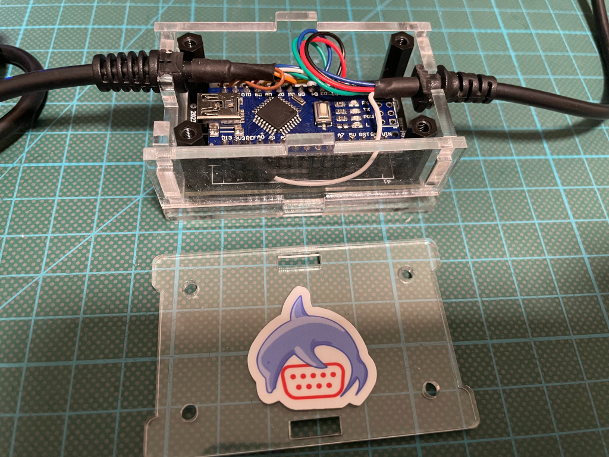
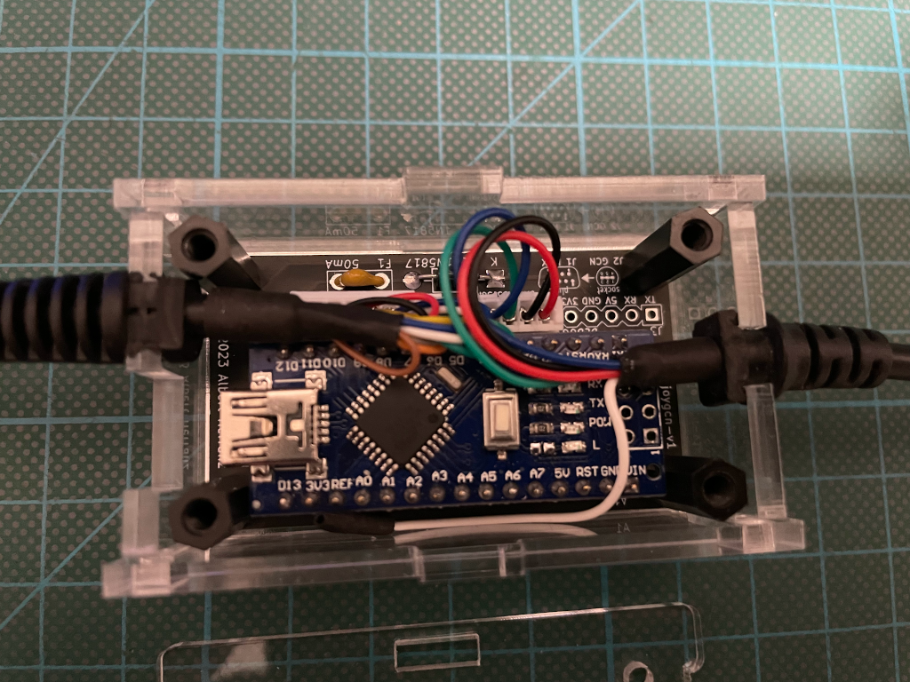
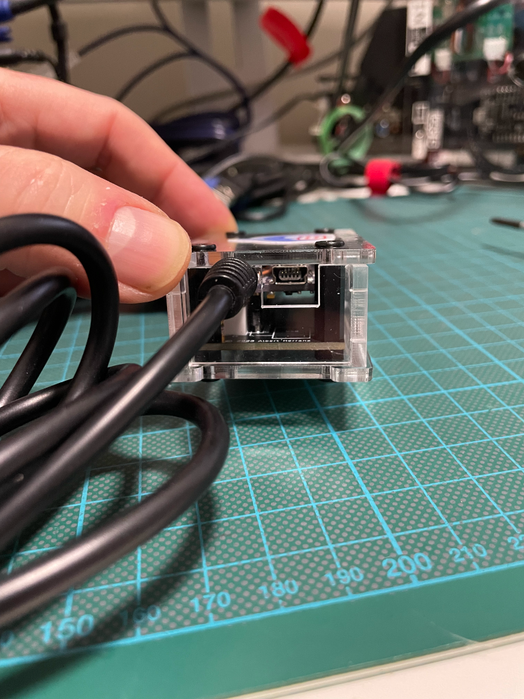
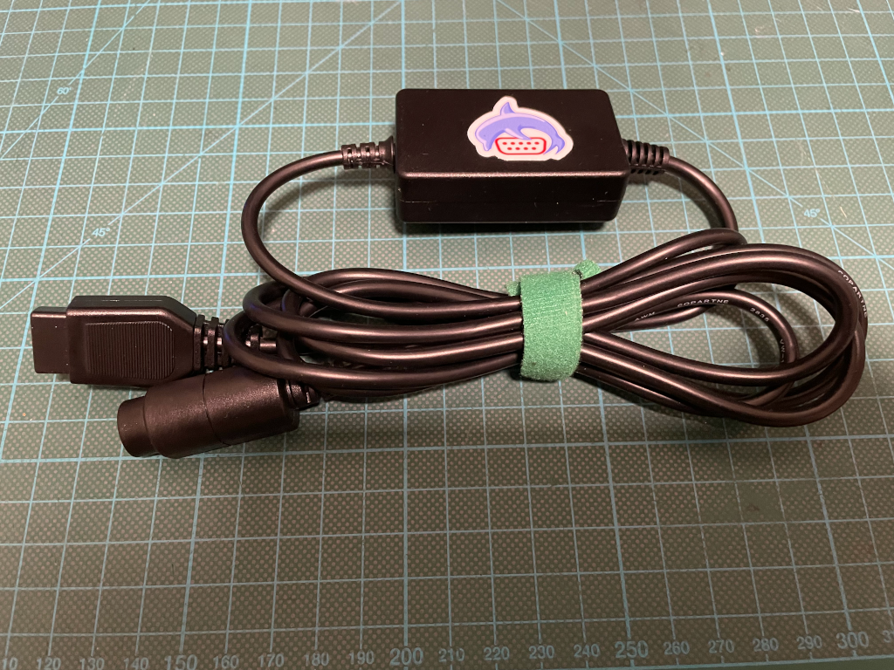
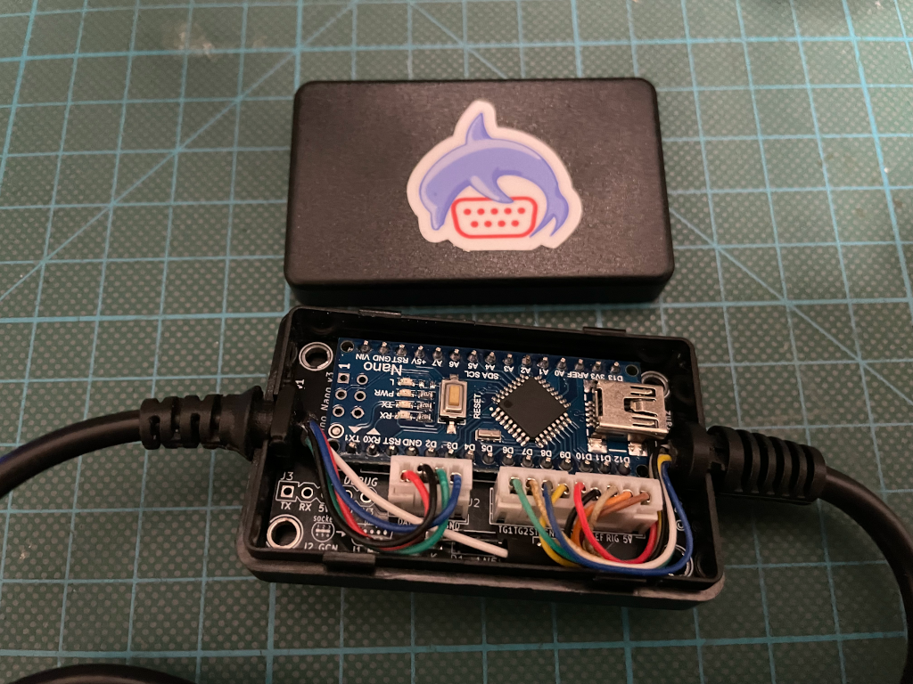

# Nintendo Gamecube controller adapter for MSX (msx-joydolphin) v1

Connect [Nintendo Gamecube controllers](https://en.wikipedia.org/wiki/GameCube_controller) to [MSX computers](https://www.msx.org/wiki/).

## Introduction

The msx-joydolphin is an adapter that allows connecting Nintendo Gamecube controllers to [MSX general purpose ports](https://www.msx.org/wiki/General_Purpose_port).

The main features of the msx-joydolphin v1 adapter are:
* small footprint
* made of widely available electronic components
* behaves as a cord extension between the MSX computer and the Nintendo Gamecube controller
* uses a female standard DE9 connector on the adapter's MSX joystick side
* uses a Gamecube Controller socket on the adapter's Nintendo Gamecube controller side
* no need for external power supply for wired controllers, the adapter draws current from the MSX port
* low power consumption for wired controllers (<20mA)
* serial debug provides information about the operation of the adapter
* supports WaveBird Wireless Controllers (which draw up to 150mA) when powering the adapter via USB

## Adapter Name

Why msx-joydolphin?
The first part of the name is pretty obvious: _"msx"_ as this is an adapter for MSX computers and _"joy"_ as this is a joystick adapter.
The _"dolphin"_ part comes from the project codename assigned to the Nintendo Gamecube during its development.

## [Hardware](hardware/kicad/)

The msx-joydolphin v1 adapter uses an [Arduino Nano](https://store.arduino.cc/products/arduino-nano) to convert the [Nintendo Gamecube controller signalling](http://www.int03.co.uk/crema/hardware/gamecube/gc-control.html) to the [MSX joystick standard signalling](https://www.msx.org/wiki/Joystick_control).

A small printed circuit board (PCB) is used to easily bind all components:
* The Arduino Nano is connected using female headers
* PH2.0 connectors are used to connect cable extensions
* A 2.54 pitch debug header is added for convenience
* Through-hole components are used on the front side
* Surface mount device (SMD) components are used on the back side
  * The SMD components use footprints optimized for hand-soldering

Connection to the MSX general purpose port is implemented using a DE9 joystick extension cable with a female DE9 connector on one side and a loose end on the other side.
The MSX joystick extension cable loose end is wired according to the following pinout mapping.

|  |
|:--|
| MSX joystick connector pinout, from controller plug side |

| MSX side pin | Cable color (may vary) | Signal | Arduino Nano side (port/pin/number) |
| ------------ | ---------------------- | ------ | ----------------------------------- |
| 5            | Brown                  | +5v    | _/5V/27                             |
| 4            | Orange                 | RIGHT  | PB3/D11/14                          |
| 3            | Grey                   | LEFT   | PB2/D10/13                          |
| 2            | Black                  | DOWN   | PB1/D9/12                           |
| 1            | Red                    | UP     | PB0/D8/11                           |
| 6            | Green                  | TRIG1  | PB4/D12/15                          |
| 7            | White                  | TRIG2  | PB5/D13/16                          |
| 8            | Blue                   | STROBE | PD2/D2/5                            |
| 9            | Yellow                 | GND    | _/GND/4,29                          |

The msx-joydolphin-v1 adapter ignores the MSX general purpose pin8 (OUT) signal. This is not a problem in general, but can cause incompatibilities with specific software, like MSX-HID [^2], which uses pin8 to try to guess which
kind of device is connected to a MSX general purpose I/O port. For MSX-HID, holding the Trigger B button, will put the software in FM-Towns compatible mode which will make the adapter functional.

The adapter uses open collector outputs (putting the related Arduino Nano pins in INPUT mode with pull-up registers active when in logic "1" and in OUTPUT mode LOW when in logic "0") which makes the adapter safer [^3] than the
standard MSX joystick schematic depicted in the MSX Technical Data Book, as it avoids a series of undesired conditions that can lead to bus contention/short circuits.

Power is drawn from the +5V signal of the MSX general purpose port, which is capable of delivering up to 50mA [^1].
The msx-joydolphin v1 draws below 20mA from the port when a wired controller is connected, so it is on the safe side. Anyway, the msx-joydolphin adapter uses a Positive Temperature Coeficient (PTC) resettable fuse of 50mA (F1) to limit current in case something goes wrong.

Also on the power side, a [1N5817 Schottky diode](https://www.onsemi.com/download/data-sheet/pdf/1n5817-d.pdf) (D1) is used to avoid leaking current from the msx-joydolphin adapter to the MSX in case the USB port of the Arduino Nano is connected to a computer or power supply while the adapter is plugged into an MSX.

Connection to the Nintendo Gamecube controller is done via a Nintendo Gamecube controller extension cable with a controller socket on one side and a loose end on the other side.
The Nintendo Gamecube controller extension cable loose end is wired according to the following pinout mapping.

|  |
|:--|
| Nintendo Gamecube connector pinout, from Nintendo Gamecube side |

| Gamecube socket pin | Cable color official | Cable color actual (may vary) | Signal | Comment                                                                   | Arduino Nano side (port/pin/number) |
| ------------------- | ---------------------| ----------------------------- | ------ | ------------------------------------------------------------------------- | ----------------------------------- |
| 1                   | Yellow               | White                         | +5v    | rumble, not used                                                          | N/C                                 |
| 2                   | Red                  | Red                           | DAT    | data line, uses 3v3 logic so it connects via a level shifter to PD7/D7/10 | \*( PD7/D7/10 )                     |
| 3                   | Green                | Black                         | GND    | ground                                                                    | _/GND/4,29                          |
| 4                   | White                | Blue                          | GND    | ground                                                                    | _/GND/4,29                          |
| 5                   |                      |                               |        |                                                                           | N/C                                 |
| 6                   | Blue                 | Green                         | 3.43v  | power line, 3v3                                                           | _/3v3/17                            |
| 7                   | Black                | N/A                           | GND    | ground                                                                    | N/C                                 |

The Nintendo Gamecube controller uses 3.3V for power and logic, except for the rumble motor which uses 5V.

Power for the Nintendo Gamecube controller is provided by the 3.3V pin of the FT232RL integrated in the Arduino Nano, which is capable of delivering up to 50mA [^2], enough to power a wired game controller.

As the Arduino Nano is a 5V logic microcontroller, the msx-joydolphin adapter uses a voltage level shifter based on the [BSS138 N-Channel Logic Level Enhancement Mode Field Effect Transistor](https://www.onsemi.com/pdf/datasheet/bss138-d.pdf) (Q1) to convert the Nintendo Gamecube controller DAT signal between 3.3V and 5V logic levels.

> [!WARNING]
> Do NOT connect the DAT line of the Nintendo Gamecube controller to the Arduino Nano directly, always use a voltage level shifter.
> The game controller may get damaged if you connect a 5V signal directly to the 3.3V DAT line.

If a WaveBird Wireless Controller is connected then the msx-joydolphin adapter needs to be powered via the mini USB port of the Arduino Nano, as the power consumption (150mA) is higher than what the MSX joystick port can deliver.
Althought it won't work, it is safe to connect a WaveBird Wireless Controller dongle without connecting an external USB power supply thanks to the current limitation of the PTC.
Also, connection of an external USB power supply to the Arduino Nano won't back-power the MSX computer thanks to the Schottky diode reverse current protection.

## [Firmware](firmware/msx-joydolphin-v1/)

The msx-joydolphin v1 adapter firmware uses [NicoHood's Nintendo library](https://github.com/NicoHood/Nintendo) to read the Nintendo Gamecube controller status, and it is heavily inspired on [Daniel Jose Viana "Danjovic" firmware](https://github.com/Danjovic/MSX/blob/master/NSX-64) for a similar adapter for Nintendo 64 joysticks.

The following elements are used as inputs:
* digital pad (D-Pad), as direction arrows
* analog pad, as direction arrows
* A button, as Trigger 1
* B button, as Trigger 2

Those elements' status are processed by the msx-joydolphin firmware and transformed into MSX general purpose port's signals on the fly.

The firmware uses Arduino Nano's sleep capabilities to reduce power consumption when a wired controller is used.

## [Enclosure](enclosure/)

### Acrylic

A simple acrylic enclosure design for the project is provided to protect the electronics components and provide strain relief for the extension cords.

The enclosure uses a 3mm acrylic sheet.

Later designs of the enclosure allow access to the USB port of the Arduino Nano without having to open it.

### Plastic

Another enclosure option is using an off-the-shelf plastic case of 60x36x17mm.

When using this option, the Arduino Nano must be soldered directly to the msx-joydolphin v1 board and its pin header legs must be trimmed down in order to fit within the reduced space of the case.

## References

MSX General Purpose port
* https://www.msx.org/wiki/General_Purpose_port

Gamecube controller pinout
* https://allpinouts.org/pinouts/connectors/videogame/nintendo-gamecube-controller-connector-pinout/
* http://www.int03.co.uk/crema/hardware/gamecube/gc-control.html

Arduino Nano pinout
* https://content.arduino.cc/assets/Pinout-NANO_latest.pdf
* https://www.makerguides.com/arduino-nano/

Nico Hood Nintendo Gamecube Joystick arduino library
* https://github.com/NicoHood/Nintendo

Daniel Jose Viana "Danjovic" NSX-64 project
* https://github.com/Danjovic/MSX/blob/master/NSX-64

Gamecube controller IDs
* https://www.gc-forever.com/yagcd/chap9.html#sec9

[^1]: https://www.msx.org/wiki/General_Purpose_port
[^2]: https://www.mouser.es/datasheet/2/163/DS_FT232R-11534.pdf

## Image Sources

* https://www.oshwa.org/open-source-hardware-logo/
* https://consolemods.org/wiki/images/a/a1/GameCube_Controller_Pinout.svg
* https://en.wikipedia.org/wiki/File:Numbered_DE9_Diagram.svg
* https://commons.wikimedia.org/wiki/File:Video_Game_Controller_(56427)_-_The_Noun_Project.svg
* https://logo-timeline.fandom.com/wiki/GameCube?file=Nintendo_Dolphin_1999.svg
